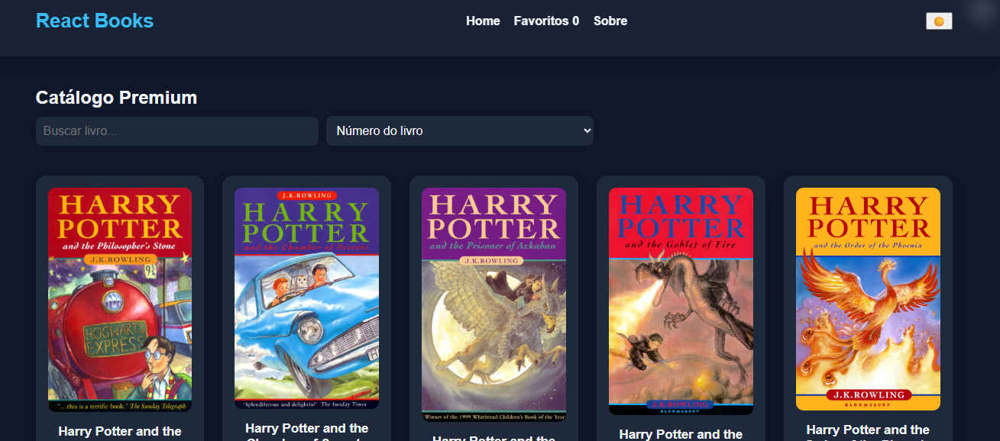
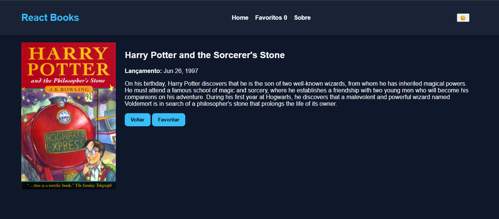
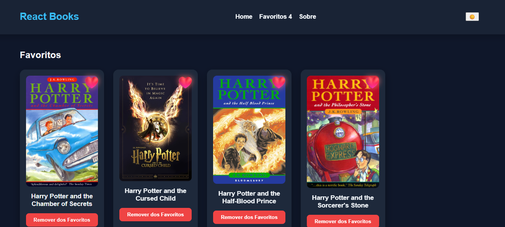

📚 React Books – Catálogo de Livros com Favoritos

Aplicação desenvolvida em React + Vite, consumindo uma API pública do universo Harry Potter. O objetivo é demonstrar consumo de API, rotas SPA, favoritos persistidos em localStorage e deploy no Vercel.

🚀 Tecnologias Utilizadas

React

Vite

React Router DOM

JavaScript ES6+

CSS Responsivo

LocalStorage

Vercel

🌐 Deploy (Vercel)

A aplicação está publicada em:

👉 https://react-vercel-app.vercel.app

🧩 Funcionalidades Implementadas

Listagem de livros via API

Busca por título

Ordenação dinâmica por título, páginas e número

Tela de detalhes do livro

Favoritar e desfavoritar livros (com animação)

Página dedicada de favoritos

Contador de favoritos na navbar

Tema claro/escuro

Layout completamente responsivo

Deploy funcional no Vercel

Repositório público conforme solicitado

## 📸 Screenshots

### 🏠 Tela Inicial

### 📖 Tela de Detalhes

### ❤️ Tela de Favoritos

🛠 Como Rodar Localmente
1️⃣ Clonar o repositório
git clone https://github.com/Santos-Oliveira/react_vercel_app.git

2️⃣ Acessar a pasta
cd react_vercel_app

3️⃣ Instalar dependências
npm install

4️⃣ Iniciar o servidor de desenvolvimento
npm run dev

Acesse no navegador:

http://localhost:5173/

🏗 Como Gerar o Build de Produção
npm run build

A saída ficará na pasta:

dist/

📄 Licença

Este projeto está licenciado sob:

Creative Commons Attribution 4.0 International (CC BY 4.0)
Você pode usar, modificar e compartilhar, desde que dê os devidos créditos ao autor.

✨ Autor

Danilo dos Santos
Projeto desenvolvido como atividade acadêmica, utilizando React + Vite e publicado no Vercel.